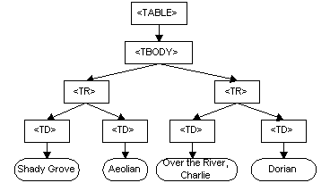

# Render-tree construction, Layout, and Paint

## Apresentação

-----------------------------------

* __name:__ Robson Júnior
* __skill:__ Javascript
* __company:__ FrontEndDeveloper['Terra Networks S/A']
* __age:__ 22
* __github/tweeter:__ robsongajunior

-----------------------------------

## HTML

__O que é HTML ?__

HyperText Markup Language (Linguagem de Marcação de Hipertexto)

HTML é nada mais nada menos que um arquivo de texto que possui uma síntaxe que usa __tags__ para que o browser saiba o que e como interpretar essas palavras.

__PS:__ Dar alguns exemplos como, quando queremos mostrar uma imagem/paragrafo/citação e por aí vai.

## CSS

Cascading Style Sheets ou apenas CSS, é uma linguagem de folha de estilo, é o responsável por hoje nós termos uma página
bonita, cheio de cores/animações etc...

`css
body {
    background-color: #dedede;
}

.wrap-content {
    width: 75%;
    height: 50%;
    margin: 0 auto;
    background-color: #fff;
    border-radius: 4px;
    border: solid 1px rgba(0,0,0,0.2);
}
`

__CRIAR PAGINA BONITONA__

## DOM
Document Object Model

### O que o DOM não é?
* Não é um documento de especificação binária.
* Não é para setar uma estrutura de dados
* O Document Object Model não define quais as informações em um documento é relevante ou como informações em um documento está estruturado. Para XML, este é especificado pelo W3C XML Information Set [Infoset]. 

### O que o DOM realmente é?
* Uma forma para que todas plafaformas conseguem entender a informação
* Responsável por especificar a interface
* O DOM é simplesmente uma API para este conjunto de informações.

## CSSOM
CSS Object Model provém APIS que permite consultar e manipular estilos e entender os stylesheets inline
que são processados equanto a página é renderizada. Responsável também pelos parses genéricos e serialização
das regras para as media queries, seletores e também o próprio css.

Mas quanto tempo levou isso tudo?

__Exemplo de quanto tempo leva o processament do CSS

## Renderizando uma webpage - DOM TREE

### Passos
* A árvore do DOM e do CSSOM se combinam para formar a árvore de renderização.
* A árvore de renderização contém apenas os nós necessários para renderizar a página.
* O layout computa a posição e o tamanho exatos de cada objeto.
* A pintura é a última etapa, que capta a árvore de renderização final e renderiza os pixels na tela.

### Construindo árvore de renderização
* Iniciando na raiz do DOM, analiza todos nodos visíveis
    - nós invisíveis
    - nodos ocultos por CSS
* Encontra no CSSOM a regra de cada nodo visível
* Devolve nodos visíveis com seus estilos computados

display: none; !== visibility: hidden;

## Repaint
Repaints são disparados quando a aparência de um elemento é alterada sem alterar seu layout.

__background-color__

## Reflow
Reflows são os mais custosos, causados quando as mudanças alterando o layout da página,
como por exemplo alterar o width de um elemento.

`
    // muito ruim

    for (var i = 0; i &lt; 100; i++) {
      document.getElementById("myList").innerHTML += "&lt;span&gt;" + i + "&lt;/span&gt;";
    }
`

`
    // bem melhor :)

    var myList = "";

    for (var i = 0; i &lt; 100; i++) {
      myList += "&lt;span&gt;" + i + "&lt;/span&gt;";
    }

    document.getElementById("myList").innerHTML = myList;
  </code>
`

`
    // bem bem melhor *--*

    var myListHTML = document.getElementById("myList").innerHTML;

    for (var i = 0; i &lt; 100; i++) {
      myListHTML += "&lt;span&gt;" + i + "&lt;/span&gt;";
    }
`
[Resultados JSPerf](http://jsperf.com/browser-diet-dom-manipulation/11)

## Tools
* Navigation Timing - Javascript

## SAMPLES
* [REPAINT](samples/repaint.html)
* [REFLOW](samples/reflow-1.html)
* [REPAINT/REFLOW](samples/repaint-reflow.html)

## References
* http://www.w3.org/TR/DOM-Level-2-Core/introduction.html
* https://developers.google.com/web/fundamentals/performance/critical-rendering-path/constructing-the-object-model?hl=en
* http://dev.w3.org/csswg/cssom/
* https://developers.google.com/web/fundamentals/performance/critical-rendering-path/render-tree-construction
* https://developers.google.com/web/fundamentals/performance/critical-rendering-path/constructing-the-object-model?hl=pt-br#css-object-model-cssom

* https://developers.google.com/web/fundamentals/performance/critical-rendering-path/measure-crp?hl=en
* https://developers.google.com/web/fundamentals/performance/critical-rendering-path/analyzing-crp?hl=en
* https://developers.google.com/web/fundamentals/performance/critical-rendering-path/optimizing-critical-rendering-path?hl=en

* http://browserdiet.com/pt/

* https://www.youtube.com/watch?v=jw4tVn7CRcI
* https://www.youtube.com/watch?v=a2_6bGNZ7bA

* https://developer.mozilla.org/pt-BR/docs/Tools/Paint_Flashing_Tool
