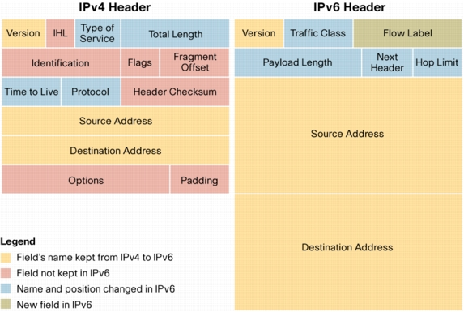

# IPV6

## O que é IPv6?
É a última versão do protocolo HTTP.
Oficializada em 06 de junho de 2012 além do deste protocolo estar
sendo implementado de forma gradual, não derrubando quem usava/usa IPV4.

## Por que o IPv6 foi criado?
Ele veio para a longo prazo substituir o IPV4, deviso ao seu limite muito superior onde iremos
ver a seguir no tópico __Comparação entre IPv4 e IPv6__ O protocolo está sendo
implantado gradativamente na Internet e deve funcionar lado a lado com o IPv4, numa situação
tecnicamente chamada de "pilha dupla" ou "dual stack".

## Comparação entre IPv4 e IPv6
o IPv6 tem como objetivo substituir o IPv4, que só suporta cerca de 4 bilhões(escala curta)/mil milhões(escala longa) (4x109)
de endereços IP, contra cerca de 340 undecilhões(escala curta)/sextiliões(escala longa) (3,4x1038) de endereços do novo protocolo.
IPV6 possui 128bit contra apenas 32bit do IPV4. Bom, acho que não preciso mais falar né.

## Formato do endereço
O IPV$ tem um simples formato, sendo assim a forma dele: 192.168.0.1, apenas um
exemplo como também poderia ter as quatro casas cheias ficando assim:__192.168.100.100__,
forma __decimal__.
O IPV6 tem uma forma __hexadecimal__ ficando __0xC0.0x00.0x02.0xEB__ o que lhe permite toda aquela quintidade
superior citada no tópico anterior.

